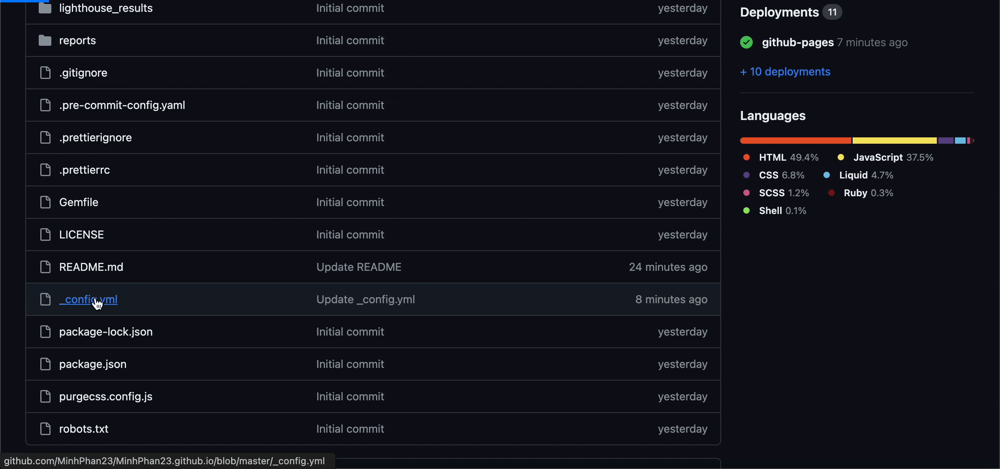
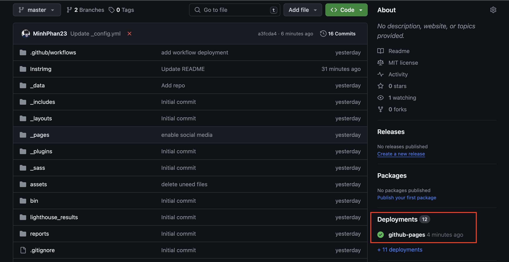
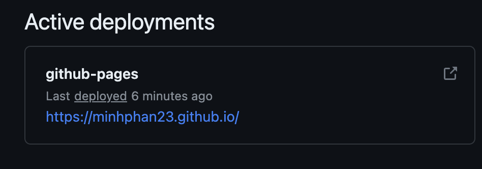
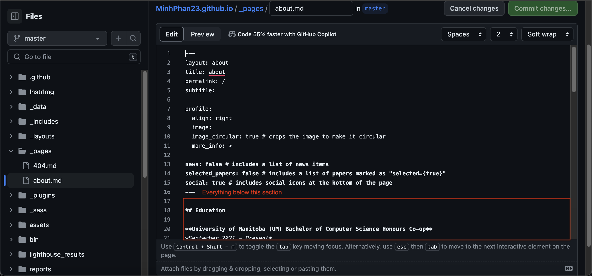

# Resume

This is a personal resume project hosted on GitHub Pages using the al-folio Jekyll theme. This document will provide instruction on how to host a resume with the exact same format.

## Getting Started

These instructions will give you a copy of the project up and running on
GitHub Pages, user site. To learn how to set up the project locally for setting purpose, please see [More Resources](#resources).

### Prerequisites

To get started, the following are required:

- A working computer with Internet connection
- A pupolar browser, Chrome is recommended
- A GitHub account
- A bit of technical vocabulary about Git
- A Markdown resume

### Instruction

1) Log in to your GitHub account.
2) Go to this [page](https://github.com/MinhPhan23/MinhPhan23.github.io)      (repository), preferably you are reading this document on the repository. 
3) Fork the repository you just go to.
   - Scroll to the top of your screen
    
   - Create a new repository name with the format `<github-username>.github.io` 
   - Click `Create fork`
   - If the repository already exist, delete it and repeat step 3.
4) Go to `Setting` and give `workflow permissions`
   - Go to `Setting`
   - Click on `Action` on the left panel
   - Choose `General`
   - Select `Allow all actions and reusable workflows` in `Actions permissions`
   - Select `Read and write permissions` in `Workflow permissions`
   
5) Edit the `_config.yml` file
   - Click on the `_config.yml` file
   - Click on the pen icon on the top right of the text
   - Use the find command `command-F` and type in `baseurl`
   - Find the text `baseurl`, make sure that it is empty
   - Change the text at `url` to the format `https://<github-username>.github.io`
   - Click on `Commit changes`
   - Click on `Commit changes` again
    
6) Wait 1-2 minutes for GitHub Pages to build and deploy  
7) Goto Deployments
    
8) Click on the link and walah
     
   - Or goto `https://<github-username>.github.io` and walah

### Customization

To replace the template with the content of your resume, goto `_pages -> about.md`, edit and paste in the content of your resume in Markdown.


<a id="resources"></a>
## More resources

- [Markdown tutorial](https://www.markdowntutorial.com/)
- [Jekyll tutorial](https://www.taniarascia.com/make-a-static-website-with-jekyll/)
- [GitHub tutorial](https://docs.github.com/en/get-started/start-your-journey/hello-world)
- [GitHub Pages tutorial](https://docs.github.com/en/pages/quickstart)
- The [README](https://github.com/alshedivat/al-folio/blob/master/README.md) from the author of this theme.

## Authors and Acknowledgements

- **Maruan** - *Provided Jekyll Theme* - [alshedivat](https://github.com/alshedivat)

See also the list of
[contributors](https://github.com/alshedivat/al-folio/graphs/contributors)
who participated in this project.

Dhairyah and Huzaifa for proof reading and suggestions for this README.

## FAQs

```
Q: How to tell if my webpage is deploying
A: By switching the branch to gh-pages, you
```

```
Q: Why my page is not loading properly
A:
```

## License

The theme is available as open source under the terms of the [MIT License](https://github.com/alshedivat/al-folio/blob/master/LICENSE).

Originally, **al-folio** was based on the [\*folio theme](https://github.com/bogoli/-folio) (published by [Lia Bogoev](https://liabogoev.com) and under the MIT license). Since then, it got a full re-write of the styles and many additional cool features.